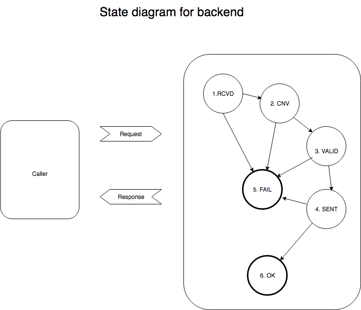

System architecture
===================

The system is designed to act as middleware between users and the Greenland ERP system, Prisme. It is built with Django, and consists of a frontend, for form display and basic validation, and a backend that handles further validation and communication with Prisme. Communication between front and back end is done using AJAX.

The basic flow is as follows:

An HTTP request comes in from a caller, which under normal circumstances is the frontend, goes through 4 states, and ends in one of two end states:

  * 1: Received by the backend/the endpoint called.
  * 2: Converted to internal representation.
  * 3: Validated.
  * 4: Sent (to Prisme).
  * 5: FAIL - if any error occurs. End state.
  * 6: OK - no errors occur. End state.

The 3 primary transitions are:

1 to 2:

  Conversion of the request, including any file(s).

  Currently this is done by the base class, JSONRestView.

2 to 3:

  Validation of the request.

3 to 4:

  Sending data to (and receiving from?) Prisme.

On any error in one of these transitions, go to state 5; if no errors occurred, go to state 6.
Both end states result in an HTTP response being sent to the caller.

The caller is expected to be our own frontend, and in order to enable uniform validation, we use a JSON-Schema for each form.
This schema is available to the frontend, so that form data can be validated there, if necessary.
The same schema is used in the backend for a second validation. The second validation is made because we cannot guarantee that data comes from our own frontend, i.e. anyone who can use the frontend can post data directly to the backend.

Django-specifics:
---------------------

* We do not use models, as there is nothing to store.

* Settings are in backend/aka/settings.py.

* Main urls are in backend/akasite/urls.py.

